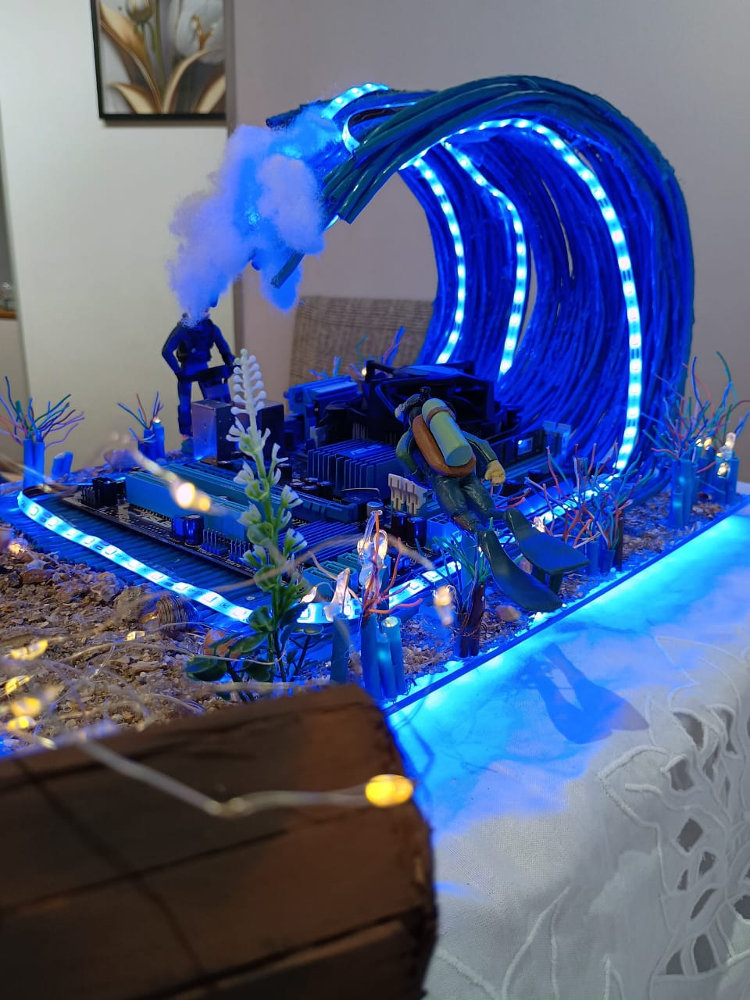

# 🖥️ Projeto CaseMod - "A Onda: Redes Submarinas"

Projeto desenvolvido no 2º semestre da faculdade para a disciplina de Arquitetura e Organização de Computadores.

---

## 💡 Contexto do Projeto

Este projeto consistiu na criação de um CaseMod com o objetivo de aplicar na prática os conceitos estudados sobre hardware e organização de computadores.

A proposta foi integrar conhecimentos adquiridos também na disciplina de Redes de Computadores, resultando em um projeto temático inspirado na maior infraestrutura de conexão global: os cabos submarinos de internet.

Assim surgiu o conceito:

🌊 **"A Onda: Redes Submarinas"**

---

## 📌 Descrição

O projeto envolveu a montagem e personalização de um computador (CaseMod), combinando aspectos técnicos e criativos.

A temática representa o ambiente submarino por onde passam os cabos de rede responsáveis pela comunicação global, utilizando elementos visuais e materiais que simulam esse cenário.

Além da estética, o projeto também envolveu:

- Montagem de hardware  
- Organização dos componentes  
- Análise e resolução de problemas  
- Configuração do sistema  

---

## 🧠 Conceitos Aplicados

Durante o desenvolvimento, foram aplicados diversos conceitos da disciplina:

### 🔹 Arquitetura e Organização de Computadores
- Estrutura e funcionamento de um computador  
- Interação entre componentes  
- Organização interna  

---

### 🔹 Hardware

- Processador (CPU)  
- Placa-mãe e seus tipos  
- Barramentos  
- Configurações em bits  
- Comunicação entre componentes  

---

### 🔹 Montagem e Manuseio

- Boas práticas de montagem  
- Uso de equipamentos antiestáticos  
- Organização de cabos  
- Diagnóstico de problemas  

---

### 🔹 Integração com Redes de Computadores

- Conceito de cabeamento de rede  
- Uso de cabo Cat5  
- Inspiração em cabos submarinos de internet  

---

## 🛠️ Materiais e Equipamentos Utilizados

- Cabo de rede Cat5  
- Fita LED 3528 (azul)  
- Fios de fada (iluminação decorativa)  
- Conchas decorativas  
- Placa acrílica (30cm x 40cm)  
- Bonecos decorativos (mergulhadores)  
- Cola instantânea  
- Cola quente (2 tubos)  
- Kit de luva + pulseira antiestática  
- Placa-mãe Asus ATX DDR3  

---

## 💰 Custo do Projeto

Grande parte dos materiais foi reaproveitada ou já disponível.

💵 Custo total aproximado: **R$ 136,00**

---

## 🎥 Vídeo do Projeto

Este projeto conta com um vídeo demonstrando o processo e o resultado final:

👉 [Assistir vídeo](https://drive.google.com/file/d/1iv7pvAfIJuP4ZS2323g5gi6nSguH97tA/view?usp=drive_link)

---

## 📄 Apresentação

Confira os slides do projeto:

👉 [Abrir apresentação](apresentacao-casemod.pdf)

---

## 📷 Resultado do Projeto

---

## 📷 Observações

O submarino presente nas imagens foi um elemento adicional incluído para enriquecer o cenário do projeto.

Outros componentes como fonte, teclado, mouse e monitor foram reaproveitados de equipamentos disponíveis.

---

## 🎯 Objetivo

Aplicar de forma prática os conhecimentos de hardware, montagem e organização de computadores, desenvolvendo também habilidades de criatividade, integração de disciplinas e resolução de problemas.

---

## 📅 Semestre

2º Semestre - 2024
